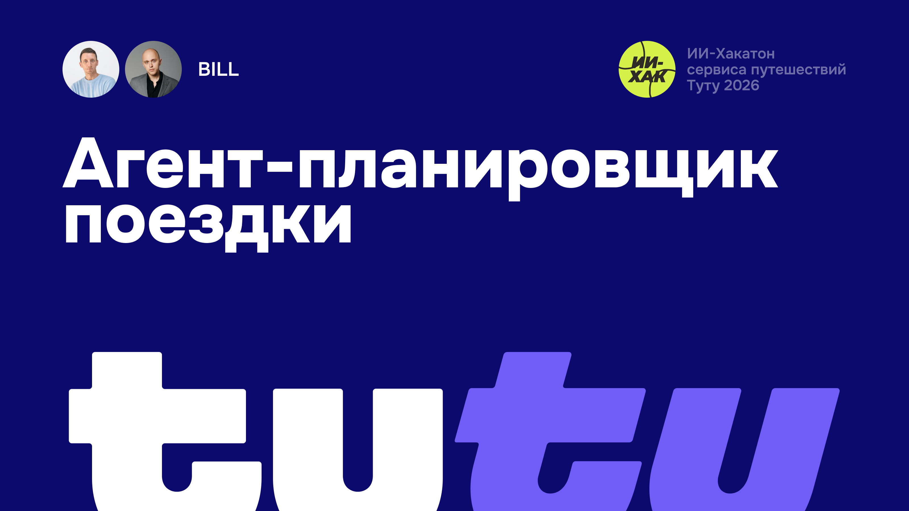

# BILL-TUTU-HACKATHON

Продукт, предложенный командой BILL SOFT CREATIVE в лице Константина Иванова (Product Manager) и Рустама Байбулатова (Designer).

- Константин Иванов — Product Manager, [@vonavikon](https://t.me/vonavikon)
- Рустам Байбулатов — Designer, [@baybulatovDesign](https://t.me/baybulatovDesign)

## Документы

- [product-description.md](product-description.md) — описание продукта для руководителей.
- [product-docs/](product-docs/) — исследования и гипотеза продукта:
  - [Гипотеза одного окна](product-docs/hypothesis-one-window.md)
  - [Экономика: издержки LLM и что он даёт продукту](product-docs/economics.md)
  - [Частота использования ИИ в поиске путешествий](product-docs/ai-usage-frequency.md)
